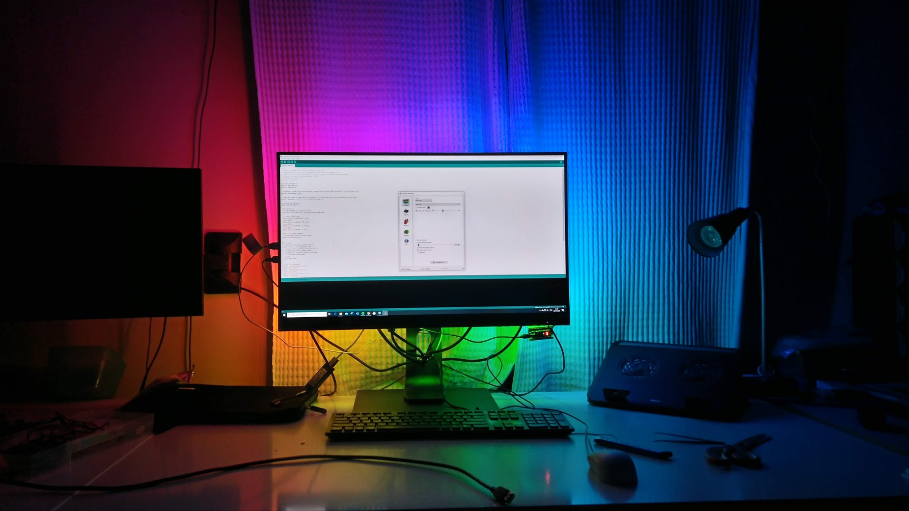

# Ambilight
#### Simon Van den Bossche
Ambilight project for monitor (handy if you watch tv, movie or a serie on your monitor from a distance)

A couple of years ago I bought a WS2812B ledstrip to experiment with. I thought 'why not using a part of it to make an ambilight functionality for my monitor'. Because I use my monitor as a tv to watch a movie or series.

## Requirements
* Arduino Nano (or other Arduino board but the Nano is priced very low)
* Solder station
* WS2812B led strip (the length depends on the outline of your monitor)
* Double-sided tape (Optional, this was needed in my case because the glue on the back of the led strip was not strong enough to keep them stick on the back of my monitor)
* Some wires (to solder the ledstrip parts together) - 3 colors (green, red, black)
* A pincet

# Getting Started
1) Cut the ledstrip in 4 pieces where the length covers the outline of your monitor. Keep in mind that depending on your monitor the ledstrip part at the button of the screen can be of a different length. In my case my monitor has an extra USB port functionality whereby I had to adjust the length of the ledstrip at that side of the screen; which you can see on the picture below

2) When you cut the piece, stick it at the back of your screen. In my case the glue at the back of the ledstrip was not good anymore, therefore I used doublesided tape.

3) Now it is time die solder the ends of each ledstrip part together. Therefore you have to cut some wires and use a pincet (to not burn your fingers while soldering ;)).

4) Solder the wires to the Arduino Nano. 

5) Next you have to connect the red and black wires of the ledstrip to a 5V powersupply (which delivers enough Amperes to drive your ledstrip - 2A will be enough). For this step I used a 5V USB power supply which I had lain around.

6) Also use a mini-USB type B to connect the Arduio Nano to your computer.

7) When you finished the last step, you start programming in the Arduino IDE. In my case I used an Arduino Nano which is very cheap (especially on Aliexpress) and small enough. 

8) Flash the program on the arduino.

9) Download the Prismatik software on your Windows computer

10) Now the fun part can start
